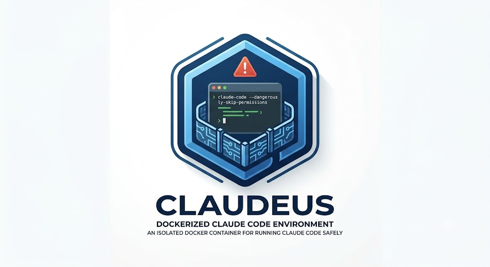

# Claudeus — Claude Code Sandbox

An isolated Docker environment for running Claude Code with `--dangerously-skip-permissions` without exposing the host machine. Based on Anthropic's reference devcontainer (`anthropics/claude-code`), adapted for Python/ML development: Python 3 + `uv` preinstalled, PyPI and Hugging Face allowed through the firewall, and optional Docker-in-Docker support via [sysbox](https://github.com/nestybox/sysbox).

**Tested on:** Ubuntu 26.04 LTS (kernel 7.0). It should work on any reasonably recent Linux distribution with Docker CE installed natively (not via snap) — the Dockerfile targets Debian/Ubuntu package tooling, and sysbox officially supports Ubuntu 18.04–24.04 and Debian Bullseye/Buster (see [Docker-in-Docker](#docker-in-docker-sysbox) for details on newer, untested distros).

## Table of Contents

- [What this gives you](#what-this-gives-you)
- [Installation](#installation)
  - [Option A — Plain Docker](#option-a--plain-docker-recommended-for-cli-use)
  - [Option B — VS Code Devcontainer](#option-b--vs-code-devcontainer)
- [GitHub access](#github-access-scoped-token-no-ssh-key)
- [Customizing the egress whitelist](#customizing-the-egress-whitelist-url_whitelistyml)
- [Docker-in-Docker (sysbox)](#docker-in-docker-sysbox)
- [Python customization](#python-customization)
- [Security considerations](#security-considerations)

## What this gives you

- **Isolation**: only the current project directory is mounted into the container. No `~/.ssh`, no cloud credentials, no access to the rest of the disk.
- **Egress firewall**: default-DROP policy, strict whitelist (Anthropic API, GitHub, npm, PyPI, Hugging Face, plus whatever you add). Even if compromised via a prompt injection, Claude cannot exfiltrate to an arbitrary domain — see [Security considerations](#security-considerations) for the limits of this guarantee.
- **Non-root user**: required by Claude Code for skip-permissions mode.
- **Persistent auth**: `~/.claude` lives in a named Docker volume, no re-authentication on every session.
- **Optional Docker-in-Docker**: with [sysbox](https://github.com/nestybox/sysbox) installed on the host, the sandbox can run its own isolated `dockerd` — Claude can `docker build`/`docker run` from inside the sandbox without `--privileged` or a host socket bind-mount.

## Installation

### Option A — Plain Docker (recommended for CLI use)

```bash
# Install (once)
git clone <this-repo-url> ~/tools/claudeus     # or: cp -r claudeus ~/tools/
chmod +x ~/tools/claudeus/claudeus
mkdir -p ~/.local/bin
ln -s ~/tools/claudeus/claudeus ~/.local/bin/claudeus   # make sure ~/.local/bin is on your PATH

# Daily use — pass the project path as the first argument
claudeus ~/projects/my-project          # Claude in autonomous mode (yolo, the default)
```

Other modes, and running from inside the project directory:

```bash
claudeus ~/projects/my-project yolo     # same as above, explicit
claudeus ~/projects/my-project claude   # Claude in normal mode (with prompts)
claudeus ~/projects/my-project shell    # bash shell in the container

cd ~/projects/my-project
claudeus                                # path omitted → uses the current directory
```

First run: builds the image (~2-3 min), then `claude` will ask you to authenticate. Auth is kept for subsequent sessions. If you edit the Dockerfile later, remove the stale image (`docker rmi claudeus`) so it gets rebuilt on the next run.

### Option B — VS Code Devcontainer

```bash
cp -r ~/tools/claudeus/.devcontainer ~/projects/my-project/
```

Then open the project in VS Code → "Reopen in Container". Once inside, open a terminal → `claude --dangerously-skip-permissions`.

## GitHub access (scoped token, no SSH key)

The idea: a revocable, narrowly-scoped fine-grained PAT, never your SSH keys, inside the container.

1. **Create the token**: github.com → Settings → Developer settings → Personal access tokens → Fine-grained tokens → Generate new token.
   - Repository access: "Only select repositories" → only the repos you need
   - Permissions: Contents (Read and write), Pull requests (Read and write), Issues if needed
   - Expiration: 30 or 90 days

2. **Store it on the host** (outside any repo):

   ```bash
   mkdir -p ~/.config/claudeus
   cat > ~/.config/claudeus/env <<'EOF'
   export GH_TOKEN="github_pat_XXXX"
   export GIT_USER_NAME="Your Name"
   export GIT_USER_EMAIL="you@email.com"
   EOF
   chmod 600 ~/.config/claudeus/env
   ```

3. **That's it.** `claudeus` sources this file automatically, passes the token into the container, and wires git to it via `gh auth setup-git`. Inside the container, `git clone/push`, `gh pr create`, etc. work out of the box — use **HTTPS** URLs (not `git@github.com:`).

For the VS Code devcontainer: export `GH_TOKEN` in your shell before launching VS Code (`devcontainer.json` picks it up via `${localEnv:GH_TOKEN}`).

If in doubt, or if the agent behaves suspiciously: revoke the PAT on GitHub, all access is cut instantly.

## Customizing the egress whitelist (`URL_whitelist.yml`)

The whitelist lives in [`.devcontainer/URL_whitelist.yml`](.devcontainer/URL_whitelist.yml), not buried in a shell script — edit it directly:

```yaml
domains:
  - registry.npmjs.org       # npm install
  - api.anthropic.com        # Claude Code
  - pypi.org                 # pip install

optional_domains:
  - sentry.io                 # Claude Code telemetry
```

- `domains`: required — the sandbox **fails to start** if one of these can't be resolved.
- `optional_domains`: best-effort — a resolution failure only logs a warning (useful for telemetry endpoints Claude Code can live without).

**No image rebuild needed.** The file is bind-mounted read-only into the container and re-read by `init-firewall.sh` on every startup — edit it, relaunch the sandbox, done. (A copy is also baked into the image as a fallback default, in case you're running the container without the bind-mount.)

Golden rule: only whitelist what the project actually needs. Every domain added here is a potential exfiltration channel, even under prompt injection.

Note: the firewall resolves domains to IPs at container startup. For CDNs with highly dynamic IPs, you may need to re-run `sudo /usr/local/bin/init-firewall.sh` mid-session.

## Docker-in-Docker (sysbox)

Claude may need to build or run containers from inside the sandbox itself (image builds, integration tests...). Rather than `--privileged` or a bind-mount of the host's Docker socket — both of which would defeat the isolation this repo is built around — the sandbox uses [sysbox-runc](https://github.com/nestybox/sysbox): a container runtime that lets an inner `dockerd` run fully isolated from the host's Docker daemon via a complete user-namespace, without elevated host privileges.

### Prerequisites (host, one-time)

```bash
docker stop <any running containers, if needed>   # installing sysbox restarts the host Docker daemon
sudo cp /etc/docker/daemon.json /etc/docker/daemon.json.bak
wget https://github.com/nestybox/sysbox/releases/download/v0.7.1/sysbox-ce_0.7.1.linux_amd64.deb
sudo apt-get install -y jq
sudo apt-get install -y ./sysbox-ce_0.7.1.linux_amd64.deb
docker info | grep -i sysbox   # should list sysbox-runc
```

Officially supported: Ubuntu 24.04 (Noble, kernel 6.8+), 22.04, 20.04, 18.04, Debian Bullseye/Buster. This setup has been validated on **Ubuntu 26.04 (kernel 7.0)**, which is newer than sysbox's official compatibility matrix but works fine with the generic `.deb` package. On other recent distros it should work too, but isn't guaranteed — if the package fails, see [nestybox/sysbox](https://github.com/nestybox/sysbox) for a from-source build.

### What changes

- `claudeus` and the devcontainer launch the container with `--runtime=sysbox-runc` (no more `--cap-add=NET_ADMIN`/`NET_RAW`: sysbox already grants root the capabilities it needs inside its own user-namespace).
- An inner `dockerd` starts automatically when the sandbox launches. `docker build` / `docker run` work directly from inside the sandbox.
- Inner Docker images/layers persist in a dedicated named volume (`claudeus-dind` for the CLI script, `claudeus-dind-${devcontainerId}` for the devcontainer), separate from the host's own `/var/lib/docker`.
- **The egress whitelist also applies to nested containers**: `init-firewall-dind.sh` populates the `DOCKER-USER` chain (the insertion point Docker provides for exactly this kind of rule, evaluated before its own permissive bridge rules) with the same `allowed-domains` ipset as the sandbox itself. A container launched from inside the sandbox can't exfiltrate to a domain outside the whitelist either.

### Known limitation: multiple GPUs

sysbox's GPU passthrough currently has a documented bug with **multi-GPU hosts** ([nestybox/sysbox#901](https://github.com/nestybox/sysbox/issues/901)): GPU access works reliably on single-GPU machines but is not reliably supported when the host has more than one GPU. If your workload needs multi-GPU access from inside the sandbox, this is not currently guaranteed to work — test before relying on it, and consider running without sysbox (and without inner DinD) for multi-GPU workloads.

## Python customization

The Dockerfile installs Python 3 (Debian bookworm → 3.11) and `uv`. Inside the container:

```bash
uv venv && source .venv/bin/activate
uv pip install -r requirements.txt
```

To pin a specific Python version or add system libraries (e.g. `ffmpeg` for TTS work), edit the `apt-get install` block in the Dockerfile.

## Security considerations

### Risk of `--dangerously-skip-permissions`

The `yolo` mode runs Claude Code with all permission prompts disabled — every tool call (file edits, shell commands, network requests within the whitelist, git operations) executes without asking for confirmation. This is what makes the sandbox necessary in the first place: it trades human-in-the-loop review for containment. Concretely, this means:

- A single bad decision by the model — misinterpreting a task, following a manipulated instruction, or simply making a mistake — can execute immediately and irreversibly *inside the container* (deleting files, force-pushing, running destructive commands) before you have a chance to notice.
- Anything reachable from inside the container is fair game: the mounted project directory, whatever's in the whitelisted network destinations, and the credentials explicitly passed in (`GH_TOKEN`, git identity).
- Review `git diff` regularly during long autonomous runs, and treat the scoped GitHub PAT as your kill switch — revoking it on GitHub cuts access instantly if something looks wrong.

Never run `yolo` mode directly on the host, outside this sandbox (or an equivalent isolation layer) — the same skip-permissions flag without containment gives the model unrestricted access to your real filesystem, credentials, and network.

### Prompt injection via external resources

Claude Code fetches and reads content from outside the conversation as part of normal operation: web pages, file contents, command output, API responses, README files, issue/PR text, package metadata, etc. Any of that content can contain text engineered to look like instructions — a prompt injection. If the model treats injected text as a legitimate command, it can attempt actions the user never asked for, using whatever tools and access are available to it in that moment.

The sandbox does not prevent prompt injection from happening — it limits what a successfully injected instruction can *do*:

- Filesystem access is limited to the mounted project directory — no `~/.ssh`, no cloud credentials, no access to the rest of the host disk.
- Network egress is limited to the whitelist in `URL_whitelist.yml` — a compromised agent can't exfiltrate data to an arbitrary attacker-controlled domain, and (with DinD/sysbox) neither can containers it spawns inside the sandbox.
- Credentials exposed inside the container are limited to what you explicitly pass in (scoped GitHub PAT, git identity) — never your full SSH key or long-lived cloud credentials.

This significantly reduces the blast radius but does not eliminate the risk — see the next section for what remains.

### What sandboxing does not eliminate

- **The container protects the host, not what's inside the container.** A malicious or compromised project can read everything mounted into it, including Claude's own credentials in `~/.claude`. Reserve this setup for trusted repositories.
- **The whitelist is a domain list, not content inspection.** Anything reachable *within* a whitelisted domain (e.g. an attacker-controlled npm package, a malicious PyPI release, a compromised Hugging Face repo) is still reachable — the firewall stops exfiltration to new destinations, it doesn't vet the content coming from allowed ones.
- **Data already inside the container can leave through whitelisted channels.** If GitHub is whitelisted (it needs to be, for git operations) and the agent's scoped PAT has write access, a sufficiently manipulated agent could still push data to a repo it has access to. Keep the PAT's repo scope as narrow as possible.
- **Never mount host secrets** (`~/.ssh`, `~/.aws`, production `.env` files). Prefer scoped, short-lived tokens (e.g. a fine-grained GitHub PAT).
- **No system is 100% immune.** Isolation reduces the blast radius; it does not eliminate it. Monitor what Claude does, especially on long-running tasks: `git diff` before committing, container logs if something looks off.
